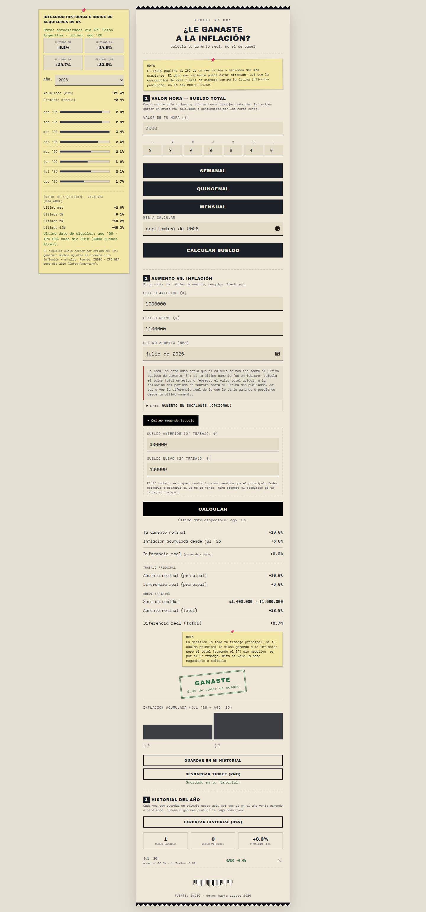
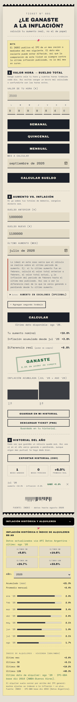
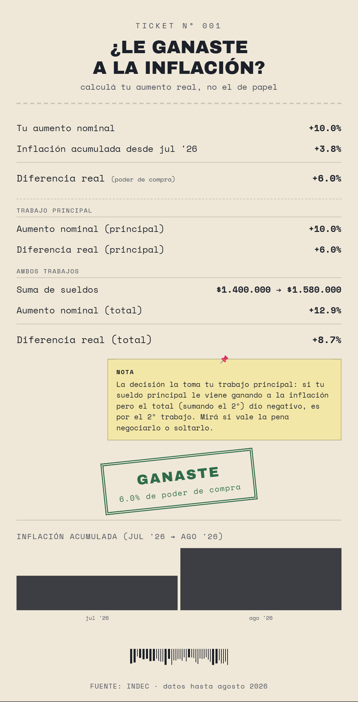

# ¿Le ganaste a la inflación?

Calculá tu **aumento real** — no el de papel. Elegís el mes de tu último aumento, cargás tu sueldo anterior y el nuevo, y el ticket te dice cuánto ganaste o perdiste contra el IPC del INDEC, en poder de compra.

Proyecto 100% frontend, sin frameworks, con datos reales del INDEC vía la API de Datos Argentina.

**Demo en vivo:** [ticket-inflacion.vercel.app](https://ticket-inflacion.vercel.app/)

## Screenshots

Versión desktop (nota lateral con inflación histórica + índice de alquileres, segundo trabajo, historial):



Versión mobile (ticket primero, datos desplegables en acordeón):



El ticket descargable en PNG:



## El problema

En Argentina los aumentos de salario se negocian contra una inflación que casi siempre va por arriba. Un aumento **nominal** de 8% frente a un IPC del 12% no es un aumento: es una pérdida de poder de compra. Esta app traduce el "porcentaje de papel" al resultado real, y lo presenta como un ticket de compra: o le ganaste a la inflación, o perdiste.

## Funcionalidades

- **Valor hora → sueldo total**: cargás tu hora y tus horas por día; calcula el total del período (mensual / quincenal / semanal) y lo podés volcar directo como sueldo anterior o nuevo.
- **Aumento vs. inflación**: los tres datos (sueldo anterior, sueldo nuevo, mes del último aumento) y el ticket compara desde ESE mes hasta el último IPC publicado.
- **Diferencia real**: `(1 + aumento nominal) / (1 + inflación) - 1` → verde si ganaste poder de compra, rojo si perdiste, con sello estilo franqueo.
- **Segundo trabajo**: comparación individual + total de ambos, con aviso de que el veredicto lo da el trabajo principal.
- **Aumento en escalones**: paritarias pagadas en tramos.
- **Historial local**: la app guarda cada cálculo en tu navegador (localStorage) con agregados del mes (ganados / perdidos / promedio real).
- **Exportar CSV**: historial completo con formato es-AR (coma decimal, `;`, fecha local) y 11 columnas (sueldos, %, inflación, y datos del segundo trabajo).
- **Descargar ticket (PNG)**: el resultado se exporta como imagen para compartir.
- **Datos en vivo**: nota lateral con inflación histórica (acumulado por año, promedios, chips 3/6/9/12M) e índice de alquileres de la vivienda (GBA/AMBA).
- **Mobile primero**: en teléfonos, el ticket es lo primero que se ve; la nota de datos se despliega con un acordeón.

## Cómo se calcula

1. El mes del **último aumento** define la ventana: acumulás el IPC desde ese mes hasta el último dato publicado por el INDEC.
2. El **aumento nominal** es `(sueldo nuevo / sueldo anterior) - 1`.
3. El **resultado real** es `(1 + nominal) / (1 + inflación) - 1`: ese porcentaje es lo que cambió tu poder de compra.

> Recomendación integrada: calculá sobre tu último período de aumento. Si tu último aumento fue en febrero, compará tu sueldo anterior a febrero contra el actual, y la inflación de febrero al último mes publicado.

## Datos y fuentes

La app consume series del **INDEC** a través de la API pública de Datos Argentina (`apis.datos.gob.ar`):

- **IPC Nivel General Nacional** (base dic 2016) — es el dato que decide el ticket.
- **IPC-GBA · Alquiler de la vivienda** (base dic 2016) — referente para inquilinos.

La primera vez, o si no hay conexión, usa una copia local incrustada de la serie como respaldo (la actualiza sola cuando la API responde). **Todo lo que cargás y guardás queda en tu navegador; no se sube a ningún servidor.**

## Stack

| | |
|---|---|
| Lenguajes | HTML, CSS, JavaScript (vanilla, sin frameworks ni build) |
| PNG | html2canvas |
| Persistencia | localStorage |
| Test unit / CSV | Node.js (38 asserts) |
| Test de navegador | Playwright + Edge (64 asserts, desktop y mobile) |
| Estética | Tipografías Space Mono + Archivo Black (Google Fonts) |

## Correrlo en local

```
# Opción 1: abrir directo
abrir index.html

# Opción 2: servidor estático
npx serve .
```

Sin dependencias, sin build, sin backend.

## Estructura

```
index.html      → markup y datos incrustados de respaldo
app.js          → cálculo, API INDEC, historial/CSV, render de notas
estilos.css     → diseño de ticket, layout 3 columnas, responsive, print
screenshots/    → capturas para este README
```

## Nota

Los datos del IPC que publica el INDEC llegan con un desfasaje de ~la mitad del mes siguiente; el ticket siempre compara contra el **último mes publicado**, no contra el mes en curso.